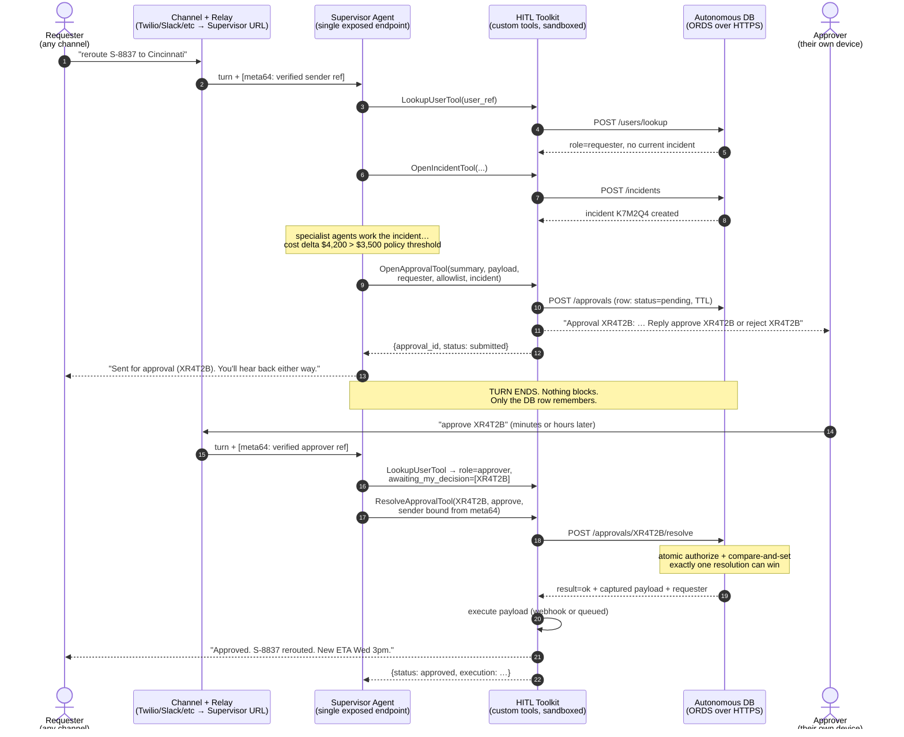
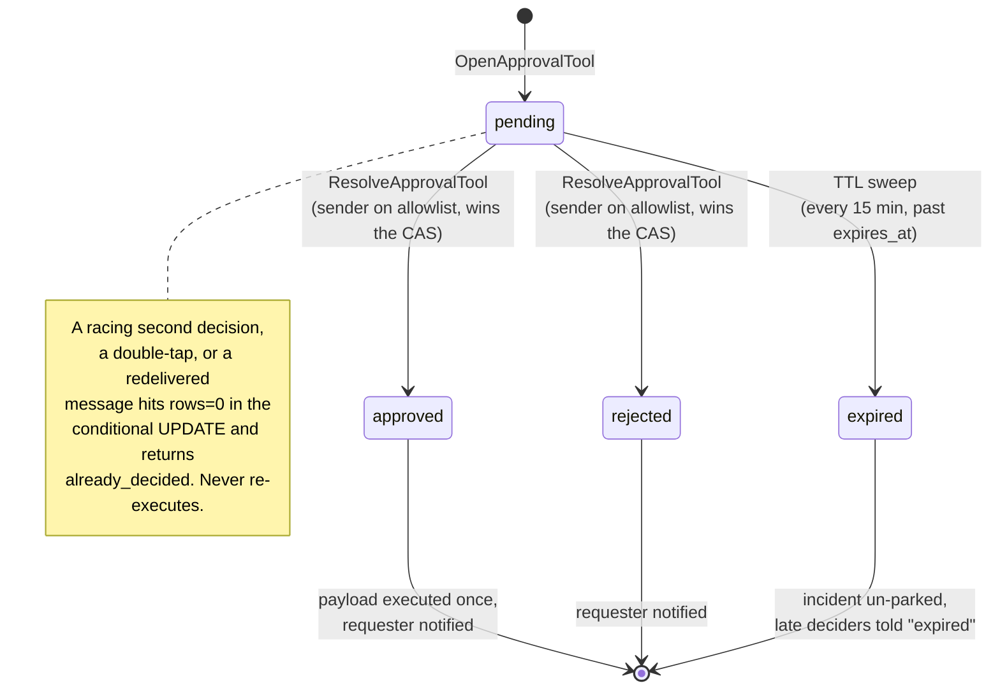

# HITL Toolkit — human-in-the-loop for AgentFlow

A **channel-agnostic** human-in-the-loop system for AIDP agent flows:

- **Approval gates** — escalate a high-impact action to a separate human
  approver *without blocking the agent or holding compute*. The decision
  arrives as a normal later turn; the captured action executes exactly once.
- **Incidents** — durable business state with short human-typable IDs
  (`K7M2Q4`) so anyone can resume a conversation days later, from any channel.
- **User lookup** — who is behind this verified phone/email/slack ref, what
  can they do, and what were they last working on (session windows)?

SMS via Twilio is **one adapter, not a requirement**. Every notification the
toolkit produces can instead be *returned to the calling flow* for delivery
over whatever channel it owns — a chat reply, a Slack tool, an email tool
(`notify_mode=defer`). The state machine is identical either way.

## Why this shape (not interrupt/resume)

The productized `/chat` wraps every turn as a fresh message and never issues
`Command(resume=...)`, so a flow cannot resume a paused graph, and a
sandboxed custom tool cannot hold a process open for hours. So: the tool
records the pending action and **returns immediately**; the approver's reply
is a **normal later turn**, not a resume. The only thing keeping an approval
alive between turns is a row in Autonomous Database.

## The flow



Approval lifecycle:



## The six tools

| Tool | When the agent calls it |
|---|---|
| `LookupUserTool` | **First, on every inbound turn.** Who is this (by verified ref), what's their role, do they have a current in-window incident, are any approvals waiting on them? |
| `OpenIncidentTool` | New piece of work → durable incident + short ID. Quote the ID in every outbound message. |
| `GetIncidentTool` | Someone quotes an ID, or LookupUser returned a current incident. Loads state + approvals; refreshes the session window. |
| `UpdateIncidentTool` | The flow learned something → update summary/detail; close/resolve when done. |
| `OpenApprovalTool` | An action crosses a policy threshold → open the gate, notify approvers, end the turn. |
| `ResolveApprovalTool` | An approver's decision turn arrives → atomic resolve, execute-once, notify requester. |

## Security invariants (non-negotiable)

1. **Identity authorizes, ID correlates.** `sender_ref` / `user_ref` must be
   the *verified* channel identity from your relay (Twilio's `From` field,
   Slack's member ID), carried into the flow via the `[meta64:]` envelope.
   In a CODE flow, **bind it at tool-construction time** so the LLM cannot
   supply it (see wiring below). Otherwise "I am +1-555-BOSS, approve X"
   prompt-injection wins.
2. **Atomic status flip in the database.** The conditional
   `UPDATE … WHERE status='pending'` is the gate; `SQL%ROWCOUNT` decides who
   won. Double-taps, redelivered messages, and racing approvers cannot cause
   re-execution.
3. **Execute the captured payload, not a conversation re-run.** Re-running
   the agent off the transcript could reach a different decision. The stored
   `action_payload` is what was approved; that is what executes.
4. **TTL is a column + a sweep job**, not held compute. Abandoned approvals
   expire on their own; their incidents un-park automatically.

---

# How to enable it — end to end

## Step 1 — Database (one file, one run)

Open **OCI Console → your Autonomous DB → Database Actions → SQL**, log in
as **ADMIN**, then:

1. Open [`db/install.sql`](db/install.sql).
2. Find/replace the two `CHANGE_ME` passwords (schema owner + tool user).
3. Paste the whole file into the worksheet, **Run Script (F5)**.
4. The verification query at the bottom should list **7 rows**: 3 tables,
   1 procedure, 1 job, 2 users.

The installer is re-runnable — every block guards itself. It creates the
schema (`HITL_SVC`), the three tables, the atomic resolve procedure, seven
ORDS endpoints under `/hitl/`, the 15-minute TTL sweep, and a locked-down
login user (`HITL_TOOL`, `CREATE SESSION` only) gated by an ORDS privilege
on `/hitl/*`. Details + troubleshooting: [`db/README.md`](db/README.md).

Your ORDS base URL is
`https://<adb-host>/ords/hitl_svc/hitl/` — find `<adb-host>` under
OCI Console → your ADB → Tool Configuration.

## Step 2 — Seed the user allowlist

Who can request, who can approve. One `curl` per person (or use the Test
panel later):

```bash
curl -u HITL_TOOL:'<password>' -X POST \
  "https://<adb-host>/ords/hitl_svc/hitl/users" \
  -H "Content-Type: application/json" \
  -d '{"user_ref":"+15551230001","display_name":"Dana Dispatcher","user_role":"requester"}'

curl -u HITL_TOOL:'<password>' -X POST \
  "https://<adb-host>/ords/hitl_svc/hitl/users" \
  -H "Content-Type: application/json" \
  -d '{"user_ref":"+15559990002","display_name":"Karen Manager","user_role":"approver"}'
```

`user_role` is `requester`, `approver`, or `both`. `user_ref` is whatever
your channel verifies — E.164 phone for SMS, email address, Slack member ID.

## Step 3 — Credential bundle

Create ONE credential (AIDP Credential Store `SECRET_TOKEN`, or an OCI Vault
secret whose content is a JSON object) with these keys:

| Key | Value | Required |
|---|---|---|
| `ords_base_url` | `https://<adb-host>/ords/hitl_svc/hitl/` | yes (or put in conf) |
| `ords_username` | `HITL_TOOL` | yes |
| `ords_password` | what you set in install.sql | yes |
| `twilio_account_sid` | `AC…` | only for SMS mode |
| `twilio_auth_token` | Twilio token | only for SMS mode |
| `twilio_from_number` | `+1555…` | only for SMS mode |

Point every tool's `conf.credential_name` at it (display name, or
`ocid1.vaultsecret.…` for the Vault path). See
[`../CREDENTIALS.md`](../CREDENTIALS.md) for both setups.

## Step 4 — Upload the tool zip

AIDP → **Tools → New Tool → Code** → upload
[`hitl_approval_tool.zip`](hitl_approval_tool.zip). Six tools register. In
each tool's config, set `credential_name` (and `ords_base_url` if it's not
in the bundle).

Pick your notification mode on `OpenApprovalTool` / `ResolveApprovalTool`:

- `notify_mode=auto` (default) — SMS if Twilio creds present, else defer.
- `notify_mode=defer` — **generic HITL**: the tool returns
  `notifications: [{to, body, channel: "deferred"}]` and the calling flow
  delivers them over its own channel (chat reply, Slack tool, email tool).

## Step 5 — Smoke test from the Test panel (no channel needed)

1. `OpenIncidentTool` → `requester_ref="+15551230001"`,
   `summary="test incident"` → note the `incident_id`.
2. `LookupUserTool` → `user_ref="+15551230001"` → should return the user +
   `current_incident` you just created.
3. `OpenApprovalTool` → fill `action_summary`, `action_payload={"op":"noop"}`,
   `requester_ref="+15551230001"`, `approver_allow=["+15559990002"]`, the
   `incident_id` → note the `approval_id`. With `notify_mode=defer` you'll
   see the notification bodies in the result instead of real SMSes.
4. `ResolveApprovalTool` → the `approval_id`, `decision="approve"`,
   `sender_ref="+15559990002"` → expect `status: approved`.
5. Run step 4 **again** → expect `status: already_decided`. That's the
   atomic gate proving itself.
6. `GetIncidentTool` → the `incident_id` → incident is back to `open` with
   the decided approval in its list.

## Step 6 — Wire the supervisor (CODE flow)

Only the Supervisor's chat URL is exposed in a MAS — that's fine and
assumed. Two pieces of wiring in the supervisor's `agent.py`:

**(a) Identity comes in via `[meta64:]`, not message text.** Your relay
(Step 7) wraps every inbound as
`[meta64:<b64 of {"from":"+1555…","channel":"sms"}>] <the message>`.
`strip_query_prefixes()` (mandatory in every AIDP agent) yields the dict.

**(b) Bind the verified ref at tool-construction time** so the LLM cannot
supply someone else's identity:

```python
async def invoke(self, user_query: str, **kwargs):
    q, meta, model_id = strip_query_prefixes(user_query)
    verified_ref = (meta or {}).get("from", "")

    # Per-turn tool closures: sender identity is baked in, not an LLM arg.
    def lookup_user() -> dict:
        """Identify the current sender and load their working context."""
        return call_custom_tool("LookupUserTool", {"user_ref": verified_ref})

    def resolve_approval(approval_id: str, decision: str) -> dict:
        """Apply the current sender's approve/reject decision."""
        return call_custom_tool("ResolveApprovalTool", {
            "approval_id": approval_id,
            "decision": decision,
            "sender_ref": verified_ref,        # <- bound, never LLM-chosen
        })

    tools = [lookup_user, resolve_approval, open_incident, get_incident,
             update_incident, open_approval, *other_tools]
    agent = create_react_agent(llm, tools, checkpointer=checkpointer, ...)
```

System-prompt guidance for the supervisor: *"On every turn, call
lookup_user first. If the sender has approvals awaiting their decision and
their message contains approve/reject + an ID, call resolve_approval. If
lookup_user returns a current_incident, continue it; otherwise ask whether
this is a new issue or give an incident ID."*

## Step 7 — Channel relay (only for SMS/Slack/etc.)

The channel cannot call the Supervisor URL directly (Twilio posts
form-encoded, unsigned; the AIDP chat endpoint wants its JSON shape + OCI
auth). A ~50-line relay (OCI Function behind API Gateway) does four things:

1. Read the **verified** sender from the channel webhook (Twilio `From`).
2. Strip any `[meta64:…]`-looking text the sender typed (anti-spoof), then
   prepend the real envelope: `[meta64:…] <body>`.
3. Call the Supervisor chat URL with `sessionKey = sender ref` — the AIDP
   checkpointer then gives you conversation memory across texts for free.
4. Send the chat response back over the channel (Twilio send).

Conversation memory lives in the checkpointer (keyed by sessionKey);
business state lives in ADB (incidents + approvals). Don't replay
transcripts from the DB into the LLM — `GetIncidentTool`'s summary/detail is
the re-anchor for stale sessions.

**Web/chat-UI deployments need no relay at all**: run `notify_mode=defer`,
have the flow deliver notifications as chat replies, and pass the signed-in
user's identity in the meta64 envelope from your front end.

---

## Data model

| Table | Purpose |
|---|---|
| `hitl_users` | `user_ref` (PK, channel-agnostic), `display_name`, `user_role` (requester/approver/both), `active` |
| `hitl_incidents` | `incident_id` (PK, short code), `status` (open/pending_approval/resolved/closed), `requester_ref`, `summary`, `detail` CLOB, `last_activity_at` (powers session windows) |
| `hitl_approvals` | `approval_id` (PK), `incident_id` (FK, nullable — gates work standalone too), `status` (pending/approved/rejected/expired), `action_summary`, `action_payload` CLOB, `approver_allow` JSON, `expires_at`, `decided_by`, `decided_at` |

ORDS endpoints (all POST, JSON, basic-auth gated by the `hitl.client`
privilege): `/users/lookup`, `/users`, `/incidents`, `/incidents/get`,
`/incidents/update`, `/approvals`, `/approvals/{id}/resolve`.

## Edge cases

| Case | Behavior |
|---|---|
| Wrong / unknown approval ID | Decider notified "no approval found"; nothing changes |
| Sender not on allowlist | "not authorized"; nothing changes |
| Double-tap / redelivered message | `rows=0` → `already_decided`; **no re-execution** |
| Two approvers race | Row lock serializes; exactly one wins; loser told "already decided" |
| Expired (past TTL) | Sweep flips to `expired`, un-parks the incident; late decider told "expired" |
| Execution fails after approve | Row stays `approved` (the human decision); requester told execution failed, manual follow-up |
| Requester is also an approver | Allowed only if you put them on `approver_allow` for their own request — **don't**, unless your policy explicitly permits self-approval |
| Returning user, stale session | `LookupUserTool` finds no in-window incident → agent asks "new issue, or do you have an incident ID?" → `GetIncidentTool` re-anchors |

## Files

```
hitl_approval_tool/
├── README.md                 ← this file
├── db/
│   ├── install.sql           ← ONE file: schema + tables + proc + ORDS + sweep + auth
│   └── README.md             ← ADB runbook + troubleshooting
├── src/
│   ├── tool_implementation.py  (6 tools)
│   ├── tool_config.json
│   └── utils/                  (config_utils, credential_resolver, …)
└── hitl_approval_tool.zip    ← upload this to AIDP
```
